# PumpFun Claims Bot

<p align="center">
  
</p>

<p align="center">
  <a href="https://github.com/nirholas/pumpfun-claims-bot/actions/workflows/ci.yml"></a>
  <a href="LICENSE"></a>
  <a href="https://github.com/nirholas/pumpfun-claims-bot/stargazers"></a>
  <a href="https://t.me/pumpfunclaims"></a>
  <a href="https://www.npmjs.com/package/pumpfun-claims-bot"></a>
  
  
  
  <a href="https://railway.com/deploy/Qab59T?referralCode=tqNsEB"></a>
</p>

<p align="center">
  Read-only Telegram channel feed that broadcasts PumpFun on-chain activity — GitHub social fee claims, token graduations, and more. Posts rich, intelligence-enriched cards to a Telegram channel in real time.
</p>

<p align="center">
  <strong><a href="https://pumpfun-claims-bot.vercel.app">Website</a></strong> · <strong><a href="https://t.me/pumpfunclaims">Live Channel</a></strong> · <strong><a href="#mcp-server">MCP Server</a></strong> · <strong><a href="docs/railway-github-claims.md">Deploy Guide</a></strong> · <strong><a href="CONTRIBUTING.md">Contributing</a></strong>
</p>

---

> **Looking for interactive monitoring?** The [telegram-bot](../telegram-bot/) supports watch management, group chats, REST API, SSE streaming, and webhooks. Use this channel-bot for simple broadcast-only channels.

## Features

### Feed Types

| Feed | Description | Toggle |
|------|-------------|--------|
| **GitHub Social Fee Claims** | GitHub devs claiming PumpFun social fee PDA rewards | `FEED_CLAIMS` |
| **Token Graduations** | Tokens graduating from bonding curve to PumpAMM | `FEED_GRADUATIONS` |

### Claim Intelligence

Every GitHub social fee claim card includes:

| Feature | Description |
|---------|-------------|
| **🚨 First-Time Alert** | `🚨🚨🚨 FIRST TIME CLAIM` banner when a GitHub user claims for the first time ever |
| **⚠️ Fake Claim Detection** | Detects when `claim_social_fee_pda` instruction is called but no fees are actually paid out |
| **📊 Claim Counter** | Sequential claim number tracked persistently across restarts |
| **💹 Lifetime SOL** | Total SOL claimed from the PDA over all time |
| **👤 GitHub Profile** | Username, bio, repos, followers, account age, location, blog |
| **𝕏 Social Links** | Twitter/X profile with follower counts (from GitHub profile) |
| **🏅 Influencer Badge** | Tier-based badge for high-follower GitHub/X accounts |
| **📈 Token Intel** | Graduated/bonding curve status, curve progress %, created age, reply count |
| **🔗 Token Socials** | Twitter, Telegram, website links from token metadata |
| **🏷️ Token Flags** | NSFW, banned, cashback status indicators |
| **⚠️ Trust Signals** | Warnings for new GitHub accounts (< 30 days), zero repos, fake claims |
| **🔗 Trading Links** | Axiom, GMGN, Padre links with affiliate codes |
| **️ Token Image** | Token image or GitHub avatar as photo card |

### Graduation Cards

Rich graduation cards include creator profile, top holders analysis, 24h trading volume, dev wallet activity, pool liquidity, and bundle detection.

### Influencer Tier System

Combines GitHub and X/Twitter follower data to classify claimers:

| Tier | Badge | X Followers | GitHub Followers |
|------|-------|-------------|------------------|
| **Mega** | 🔥🔥 MEGA INFLUENCER | ≥ 100K | ≥ 10K |
| **Influencer** | 🔥 Influencer | ≥ 10K | ≥ 1K |
| **Notable** | ⭐ Notable | ≥ 1K | ≥ 100 |

Either threshold triggers the tier — a user with 50K X followers and 50 GitHub followers still qualifies as **Influencer**.

### AI-Powered Claim Summaries

First-time claims get a one-line AI take generated by **Groq** (llama-3.3-70b-versatile):

- Analyzes 30+ signals: token metadata, GitHub profile, creator history, trading activity
- Max 120 characters — direct, opinionated, trader-focused
- 5-second timeout with graceful fallback (empty string on failure)
- HTML-sanitized output safe for Telegram

Examples:
> _"Real GitHub project, dev claimed fast"_ · _"Fork of popular repo, proceed with caution"_

## Architecture

```
Solana RPC (WebSocket + HTTP polling)
        │
        ▼
┌───────────────────┐
│  SocialFeeIndex   │──▶ Bootstraps ~148K SharingConfig → mint mappings
└────────┬──────────┘
         │
┌────────▼──────────┐
│   ClaimMonitor    │──▶ Decodes PumpFees program claim transactions
│   EventMonitor    │──▶ Decodes Pump program logs (graduations)
└────────┬──────────┘
         │ FeeClaimEvent / GraduationEvent
┌────────▼──────────┐
│ Enrichment Layer  │
│  ├─ GitHub API    │──▶ User profile, repos, followers
│  ├─ X/Twitter API │──▶ Follower counts, influencer tier
│  ├─ PumpFun API   │──▶ Token info, creator profile, holders, trades
│  ├─ ClaimTracker  │──▶ First-claim detection, persistent counts
│  └─ Fake Detect   │──▶ Instruction called but no payout (amountLamports=0)
└────────┬──────────┘
         │ ClaimFeedContext
┌────────▼──────────┐
│    Formatters     │──▶ Rich HTML cards with sections & emoji layout
└────────┬──────────┘
         │
┌────────▼──────────┐
│   grammY Bot      │──▶ Posts photo + caption to Telegram channel
│   (retry + rate   │    Falls back to text-only if photo fails
│    limiting)      │
└───────────────────┘
```

### Multi-RPC Failover

The `RpcFallback` class manages multiple Solana RPC endpoints with automatic rotation:

- **Round-robin rotation** after 3 consecutive failures on any endpoint
- **60-second cooldown** per failed endpoint before retrying
- **Earliest-expiry fallback** — if all endpoints are in cooldown, picks the one expiring soonest
- **Success resets** — a single successful call resets the failure counter
- Configure via `SOLANA_RPC_URLS` (comma-separated)

### Programs Monitored

| Program | ID | Purpose |
|---------|-----|---------|
| PumpFees | `pfeeUxB6jkeY1Hxd7CsFCAjcbHA9rWtchMGdZ6VojVZ` | Fee sharing, social fee PDA claims |
| Pump | `6EF8rrecthR5Dkzon8Nwu78hRvfCKubJ14M5uBEwF6P` | Bonding curve (graduations) |
| PumpAMM | `pAMMBay6oceH9fJKBRHGP5D4bD4sWpmSwMn52FMfXEA` | AMM (graduated pool events) |

## Install

### npm (MCP server — recommended for AI assistants)

Run the MCP server instantly with **npx** — no clone needed:

```bash
npx pumpfun-claims-bot
```

Or install globally:

```bash
npm install -g pumpfun-claims-bot
pumpfun-claims-bot
```

Add to your MCP client config (Claude Desktop, Cursor, VS Code Copilot):

```json
{
  "mcpServers": {
    "pumpfun": {
      "command": "npx",
      "args": ["pumpfun-claims-bot"]
    }
  }
}
```

> **npm package:** [pumpfun-claims-bot on npm](https://www.npmjs.com/package/pumpfun-claims-bot)

### From source (full bot + Telegram feed)

```bash
git clone https://github.com/nirholas/pumpfun-claims-bot.git
cd pumpfun-claims-bot && npm install
```

## Quick Start

### 1. Create a Telegram Bot

1. Message [@BotFather](https://t.me/BotFather) on Telegram
2. `/newbot` → follow prompts → copy the bot token
3. Create a public channel (e.g., `@pumpfunclaims`)
4. Add the bot as an **admin** to the channel (must have "Post Messages" permission)

### 2. Configure Environment

```bash
cp .env.example .env
```

```env
# ── Required ──────────────────────────────────────────────
TELEGRAM_BOT_TOKEN=your-bot-token-from-botfather
CHANNEL_ID=@your_channel_name    # or numeric chat ID like -100xxx

# ── Solana RPC ────────────────────────────────────────────
SOLANA_RPC_URL=https://mainnet.helius-rpc.com/?api-key=your-key
SOLANA_WS_URL=wss://mainnet.helius-rpc.com/?api-key=your-key

# Comma-separated fallback RPCs (rotates on 429/5xx/timeout)
SOLANA_RPC_URLS=https://mainnet.helius-rpc.com/?api-key=key1,https://your-other-rpc.com

# ── Feed Toggles (all default false except FEED_CLAIMS) ───
FEED_CLAIMS=true                 # GitHub social fee claims (default: true)
FEED_GRADUATIONS=false           # Token graduations to PumpAMM (default: false)
FEED_LAUNCHES=false              # New token launches (default: false)
FEED_WHALES=false                # Large buy/sell whale alerts (default: false)
FEED_FEE_DISTRIBUTIONS=false     # Creator fee distribution events (default: false)

# ── Claim Filter ──────────────────────────────────────────
REQUIRE_GITHUB=true              # Only post claims with GitHub social fee PDA (default: true)

# ── Enrichment APIs ───────────────────────────────────────
GITHUB_TOKEN=ghp_your_token      # Raises GitHub rate limit: 60 → 5000 req/hr
GROQ_API_KEY=gsk_your_key        # Groq API for AI one-liner summaries

# X/Twitter follower counts & influencer detection
# Get cookies from x.com DevTools → Application → Cookies
# X_AUTH_TOKEN=your_auth_token_cookie
# X_CT0_TOKEN=your_ct0_cookie

# ── Affiliate Ref Codes ───────────────────────────────────
# Appended to Axiom / GMGN / Padre trading links in cards
# AXIOM_REF=your_ref
# GMGN_REF=your_ref
# PADRE_REF=your_ref

# ── Tuning ────────────────────────────────────────────────
POLL_INTERVAL_SECONDS=30         # HTTP polling fallback interval (default: 30)
WHALE_THRESHOLD_SOL=10           # Minimum SOL for whale alerts (default: 10)
LOG_LEVEL=info                   # debug | info | warn | error (default: info)

# ── Health Check ──────────────────────────────────────────
# PORT=3000                      # Set automatically by Railway
```

### Environment Variables Reference

| Variable | Required | Default | Description |
|---|---|---|---|
| `TELEGRAM_BOT_TOKEN` | ✅ | — | Bot token — message [@BotFather](https://t.me/BotFather) → `/newbot` |
| `CHANNEL_ID` | ✅ | — | Channel to post to (`@channelname` or `-100xxx`) — get the numeric ID via [@userinfobot](https://t.me/userinfobot) |
| `SOLANA_RPC_URL` | ✅ | `https://api.mainnet-beta.solana.com` | Primary Solana HTTP RPC — free tier at [Helius](https://helius.dev), [QuickNode](https://quicknode.com), or [Alchemy](https://alchemy.com) |
| `SOLANA_WS_URL` | — | Derived from `SOLANA_RPC_URL` | Solana WebSocket URL — same provider as `SOLANA_RPC_URL`, replace `https://` with `wss://` |
| `SOLANA_RPC_URLS` | — | — | Comma-separated fallback RPC URLs — auto-rotates on 429 / 5xx / timeout |
| `FEED_CLAIMS` | — | `true` | Post GitHub social fee claim cards |
| `FEED_GRADUATIONS` | — | `false` | Post token graduation cards |
| `FEED_LAUNCHES` | — | `false` | Post new token launch cards |
| `FEED_WHALES` | — | `false` | Post whale buy/sell alerts |
| `FEED_FEE_DISTRIBUTIONS` | — | `false` | Post creator fee distribution events |
| `REQUIRE_GITHUB` | — | `true` | Skip claims that have no GitHub social fee PDA |
| `GITHUB_TOKEN` | — | — | GitHub PAT — [create one here](https://github.com/settings/tokens/new?description=pumpfun-claims-bot&scopes=) (no scopes needed) — raises rate limit from 60 → 5000 req/hr |
| `GROQ_API_KEY` | — | — | Groq API key for AI one-liner summaries — [get a free key at console.groq.com](https://console.groq.com/keys) |
| `X_AUTH_TOKEN` | — | — | X/Twitter `auth_token` cookie — open [x.com](https://x.com), DevTools → Application → Cookies → copy `auth_token` |
| `X_CT0_TOKEN` | — | — | X/Twitter `ct0` cookie (CSRF token) — same place as above, copy `ct0` |
| `AXIOM_REF` | — | — | Affiliate ref code for [Axiom](https://axiom.trade) trading links |
| `GMGN_REF` | — | — | Affiliate ref code for [GMGN](https://gmgn.ai) trading links |
| `PADRE_REF` | — | — | Affiliate ref code for [Padre](https://padre.bot) trading links |
| `POLL_INTERVAL_SECONDS` | — | `30` | HTTP polling interval when WebSocket is unavailable |
| `WHALE_THRESHOLD_SOL` | — | `10` | Minimum SOL trade size to trigger a whale alert |
| `LOG_LEVEL` | — | `info` | Log verbosity: `debug` \| `info` \| `warn` \| `error` |
| `PORT` | — | `3000` | Health check HTTP server port — set automatically by [Railway](https://railway.app) |
| `MCP_ENABLED` | — | `false` | Enable the MCP (Model Context Protocol) server for AI assistant integrations |
| `MCP_PORT` | — | `3001` | MCP server HTTP port (Streamable HTTP transport) |

### 3. Run

```bash
# Install dependencies
npm install

# Development (hot reload via tsx)
npm run dev

# Production
npm run build
npm start
```

### 4. Deploy with Docker

```bash
docker build -t pumpfun-channel-bot .
docker run -d --env-file .env pumpfun-channel-bot
```

### 5. Deploy to Railway

[](https://railway.com/deploy/Qab59T?referralCode=tqNsEB)

Railway auto-deploys from GitHub and provides persistent volumes for claim tracking data.

```bash
# Install Railway CLI
npm install -g @railway/cli
railway login

# Create & link project
railway init
railway link

# Set environment variables
railway variables set TELEGRAM_BOT_TOKEN=your-token
railway variables set CHANNEL_ID=@your_channel_name
railway variables set SOLANA_RPC_URL=https://mainnet.helius-rpc.com/?api-key=your-key
railway variables set SOLANA_WS_URL=wss://mainnet.helius-rpc.com/?api-key=your-key
railway variables set FEED_CLAIMS=true
railway variables set REQUIRE_GITHUB=true

# Create persistent volume for claim tracker data
railway volume create --mount /app/data

# Deploy
railway up
```

See [railway.json](railway.json) for the deployment config:
```json
{
  "$schema": "https://railway.app/railway.schema.json",
  "build": {
    "builder": "DOCKERFILE",
    "dockerfilePath": "Dockerfile"
  },
  "deploy": {
    "restartPolicyType": "ON_FAILURE",
    "restartPolicyMaxRetries": 10
  }
}
```

## Project Structure

```
channel-bot/
├── src/
│   ├── index.ts              # Entry point — wires monitors, enrichment, & Telegram posting
│   ├── config.ts             # Environment variable loading & validation
│   ├── mcp-server.ts         # MCP server — exposes tools via Streamable HTTP or stdio
│   ├── mcp-stdio.ts          # Standalone MCP entry point (stdio transport)
│   ├── claim-monitor.ts      # PumpFees program monitor (WebSocket + HTTP polling)
│   ├── claim-tracker.ts      # First-claim detection + claim counter (persisted to disk)
│   ├── event-monitor.ts      # Pump program log decoder (graduations, launches)
│   ├── social-fee-index.ts   # SocialFeeIndex — maps SharingConfig PDAs → mints (~148K)
│   ├── formatters.ts         # Rich HTML card builders for Telegram
│   ├── pump-client.ts        # PumpFun HTTP API client (token info, creator profiles)
│   ├── github-client.ts      # GitHub API client (user profiles, rate-limited cache)
│   ├── x-client.ts           # X/Twitter profile fetcher + influencer tier logic
│   ├── groq-client.ts        # Groq AI one-liner summaries
│   ├── rpc-fallback.ts       # Multi-RPC failover with round-robin
│   ├── health.ts             # HTTP health check server
│   ├── types.ts              # Program IDs, discriminators, event types
│   └── logger.ts             # Leveled console logger
├── data/                     # Persisted state (gitignored, Railway volume mount)
│   └── github-first-claims.json
├── Dockerfile                # Multi-stage Docker build
├── railway.json              # Railway deployment config
├── package.json
└── tsconfig.json
```

## How It Works

### Claim Detection Pipeline

```
Transaction detected on PumpFees program
  │
  ▼
Identify instruction: claim_social_fee_pda?
  │
  ├─ YES ──▶ Parse platform (2 = GitHub) + user_id from Anchor args
  │           │
  │           ▼
  │        Check amountLamports from SocialFeePdaClaimed event
  │           │
  │           ├─ amountLamports > 0 ──▶ Real claim
  │           │   ├─ Check ClaimTracker: first time for this GitHub user?
  │           │   │   ├─ YES ──▶ 🚨 FIRST TIME CLAIM banner
  │           │   │   └─ NO  ──▶ Standard claim card
  │           │   └─ Enrich: GitHub API + PumpFun API + X profile
  │           │
  │           └─ amountLamports = 0 ──▶ ⚠️ FAKE CLAIM (instruction called, no payout)
  │
  └─ NO ───▶ Other claim type (creator fee, cashback, etc.)
```

### SocialFeeIndex Bootstrap

On startup, the bot fetches all `SharingConfig` accounts from the PumpFees program to build a reverse mapping from social fee PDA addresses to token mints. This enables resolving which token a social fee claim belongs to without additional RPC calls.

- **~148K mappings** loaded at startup
- **Incremental updates** via WebSocket subscription on `CreateFeeSharingConfig` and `UpdateFeeShares` events
- **Lookup**: `socialFeeIndex.getMintForPda(pdaAddress)` → token mint
- **One PDA → many mints** — handles scammers who reuse PDAs across multiple tokens

### Fake Claim Detection

Some users call the `claim_social_fee_pda` instruction targeting random token PDAs where they have no fees to collect. The bot detects these by checking:

1. The instruction discriminator matches `claim_social_fee_pda`
2. The transaction logs contain no `SocialFeePdaClaimed` event — OR the event shows `amountLamports = 0`
3. The GitHub user ID and platform are still parsed from the instruction args (Anchor Borsh format)

Fake claims are posted with a `⚠️ FAKE CLAIM` warning and a `🚩 Fake claim — no fees paid out` trust signal.

### First-Claim Tracking

The `ClaimTracker` maintains a persistent set of GitHub user IDs that have successfully claimed:

- **In-memory set** for fast lookup during processing
- **Debounced disk persistence** (5-second delay) to `data/github-first-claims.json`
- **Split check/mark pattern**: `hasGithubUserClaimed()` checks without side effects, `markGithubUserClaimed()` only called after successful Telegram post
- **Claim counter**: `incrementGithubClaimCount()` returns sequential claim number per user
- First-claim status is NOT set for fake claims

#### Three-Layer First-Claim Verification

1. **Local dedup** — Skip if already posted (survives restarts via persisted JSON)
2. **On-chain verification** — `lifetimeClaimedLamports == amountLamports` confirms it's truly the first claim on-chain
3. **Graceful fallback** — Skips first-claim banner if verification fails (prevents false positives after redeployment)

## Example Claim Card

```
🚨🚨🚨 FIRST TIME CLAIM 🚨🚨🚨

🐙 $PUMP — PumpCoin  💹 $45K
  ↳ GitHub dev claimed PumpFun social fees

📊 Claim #1 · 0.1043 SOL lifetime ($15.65)

🏦 0.1043 SOL ($15.65)
  ↳ 8mNp...4rWz

👤 nirholas (Nicholas)
  ↳ 📦 45 · 👁 200 · 📅 5y ago
  TypeScript SDK builder
𝕏 nichxbt · 1.2K

📈 Bonding curve (72%) · Created 3h ago · 💬 12
𝕏 @pump_coin · 💬 TG · 🌐 pumpcoin.io

⚠️ GitHub account created 15d ago

CA: 7xKXt...p3Bz
Axiom · GMGN · Padre

🔍 TX
```

## Requirements

- **Node.js** >= 20.0.0
- **Telegram bot token** (via [@BotFather](https://t.me/BotFather))
- **Telegram channel** with the bot added as admin
- **Solana RPC endpoint** — dedicated RPC recommended (Helius, QuickNode, Triton). Public mainnet works but may rate-limit.
- **GitHub token** (optional) — raises API rate limit from 60 to 5,000 req/hr

## Troubleshooting

### Bot Not Posting Messages

1. **Check bot permissions** — The bot must be an admin in the channel with "Post Messages" permission
2. **Verify CHANNEL_ID** — Use `@channel_name` for public channels or the numeric ID (e.g., `-100xxx`) for private channels. To find the numeric ID, forward a channel message to [@userinfobot](https://t.me/userinfobot)
3. **Telegram 403 error** — Means the bot is NOT a member/admin of the channel. Add it via channel settings → Administrators → Add Administrator
4. **Check logs** — Set `LOG_LEVEL=debug` to see all events the bot processes

### Rate Limiting

Telegram limits bots to ~30 messages per second to a channel. The grammY framework handles rate limiting automatically:
- Messages may be delayed but won't be dropped
- The bot includes a retry helper that respects `retry_after` headers
- For very high activity, increase `POLL_INTERVAL_SECONDS` to reduce event volume

### RPC Connection Issues

- Public RPC endpoints have rate limits — for production use a dedicated RPC
- Set `SOLANA_RPC_URLS` with multiple endpoints for automatic failover
- If WebSocket disconnects, the bot falls back to HTTP polling at `POLL_INTERVAL_SECONDS`
- The `RpcFallback` class provides round-robin across configured endpoints
- Set `LOG_LEVEL=debug` to see connection status

### Missing Claims

- **GitHub claims only?** — Set `REQUIRE_GITHUB=true` to only post GitHub social fee claims
- **Feed disabled?** — Verify `FEED_CLAIMS=true` is set
- **SocialFeeIndex slow?** — Initial bootstrap fetches ~148K accounts. This takes 30-60 seconds on startup. Check logs for `SocialFeeIndex: loaded N mappings`
- **Rate limited?** — GitHub API allows 60 req/hr unauthenticated. Set `GITHUB_TOKEN` for 5,000 req/hr

### Pipeline Stats

The bot logs pipeline counters every 60 seconds:
```
Pipeline: 15 total → 8 social → 3 first / 5 repeat → 8 posted (skip: 7 cashback)
```

- **total**: All claim events received
- **social**: GitHub social fee PDA claims
- **first/repeat**: First-time vs. returning claimers
- **posted**: Successfully posted to Telegram
- **skip cashback**: Cashback claims (user refunds, not creator activity)

## Web Dashboard

A React-based web frontend is included under `packages/web/` with live monitoring capabilities.

### Pages

| Page | Route | Description |
|------|-------|-------------|
| Home | `/` | Landing page with project overview |
| Dashboard | `/dashboard` | Live event feed with SSE streaming |
| Create Coin | `/create` | Token creation interface |
| Docs | `/docs` | API documentation & Telegram commands |
| Packages | `/packages` | Package browser |

### Dashboard Features

- **Server-Sent Events (SSE)** — Real-time streaming via `/api/v1/claims/stream` with auto-reconnect (3s delay)
- **Event Filters** — All, Launches, Whales, Graduations, Claims, Distributions
- **Live Stats Bar** — Counters for each event type
- **Watch Lists** — Add/remove wallet addresses to monitor (`GET/POST/DELETE /api/v1/watches`)
- **Rich Event Cards** — Token launches, whale trades, graduations, fee claims with full context
- **Connection Status** — Visual indicator with error messages
- **Mock Data Fallback** — Simulated feed when SSE is unavailable

### Tech Stack

| Layer | Technology |
|-------|------------|
| Framework | React 18 |
| Router | React Router |
| Build | Vite 5 |
| Styling | Tailwind CSS |
| Language | TypeScript |

## MCP Server

The bot includes a built-in [Model Context Protocol](https://modelcontextprotocol.io) (MCP) server that lets AI assistants (Claude, Copilot, Cursor, etc.) query PumpFun on-chain data conversationally.

### MCP Tools

| Tool | Description |
|------|-------------|
| `get_token_info` | Token metadata, market cap, bonding curve progress, flags |
| `get_token_holders` | Top holders with concentration metrics |
| `get_token_trades` | Recent trade activity — volume, buy/sell counts |
| `get_pool_liquidity` | PumpSwap AMM pool liquidity for graduated tokens |
| `get_bundle_info` | Bundle detection (scam indicator) |
| `get_creator_profile` | Creator launch history, scam estimate, recent coins |
| `get_github_user` | GitHub profile by username or numeric ID |
| `get_claim_history` | Claim status for a GitHub user — count, mints claimed |
| `get_sol_price` | Current SOL/USD price |

### Usage: Stdio Transport (Claude Desktop / Cursor / VS Code)

Add to your MCP client config (e.g. `claude_desktop_config.json`):

```json
{
  "mcpServers": {
    "pumpfun": {
      "command": "npx",
      "args": ["pumpfun-claims-bot"]
    }
  }
}
```

Or run from source:

```bash
# Development (tsx)
npm run mcp:dev

# Production (compiled)
npm run build && npm run mcp
```

### Usage: Streamable HTTP Transport (Embedded)

Run alongside the main bot by setting `MCP_ENABLED=true`:

```bash
MCP_ENABLED=true MCP_PORT=3001 npm run dev
```

The MCP endpoint is available at `POST /mcp` on the configured port. Clients connect using the Streamable HTTP transport.

### Example Queries

Once connected, ask your AI assistant:

- *"Look up token info for mint address 7xKXt...p3Bz"*
- *"Has GitHub user 12345 ever claimed PumpFun fees?"*
- *"Who are the top holders of this token?"*
- *"Check if this token launch was bundled"*
- *"What's the current SOL price?"*

## Health Check API

The bot exposes an HTTP health check server for Railway / Docker probes.

| Endpoint | Method | Description |
|----------|--------|-------------|
| `/health` | GET | Health status with uptime and stats |
| `/` | GET | Alias for `/health` |

**Response:**

```json
{
  "status": "ok",
  "uptime": "12345s",
  "uptimeMs": 12345000
}
```

- Returns **200** for `ok`, **503** for `degraded`
- Dynamic stats injected via callback (pipeline counters, connection status)
- Port configurable via `PORT` or `HEALTH_PORT` env vars (default: 3000)

## Testing

The project uses **Vitest** with ~100+ test cases across 6 test suites.

```bash
# Run all tests
npm test

# Watch mode (re-runs on file changes)
npm run test:watch
```

### Test Suites

| Suite | File | Coverage |
|-------|------|----------|
| Claim Tracker | `claim-tracker.test.ts` | First-claim detection, persistence, counters, lifetime totals |
| Formatters | `formatters.test.ts` | HTML card generation, escaping, null handling, edge cases |
| GitHub Client | `github-client.test.ts` | URL parsing, API response handling, cache behavior |
| Groq Client | `groq-client.test.ts` | AI summary generation, API key handling, HTML safety |
| X Client | `x-client.test.ts` | Influencer tier classification, follower formatting |
| E2E Pipeline | `e2e.test.ts` | End-to-end claim tracking, formatting, GitHub feed |

## Local Development

```bash
# Install dependencies
npm install

# Run with hot reload (tsx)
npm run dev

# Type-check without emitting
npm run typecheck
```

Set `LOG_LEVEL=debug` — all events are logged to stdout regardless of whether they're posted to Telegram.

## Tech Stack

| Component | Technology |
|-----------|------------|
| **Runtime** | Node.js >= 20 (ESM) |
| **Language** | TypeScript 5.7 (strict mode) |
| **Blockchain** | Solana via `@solana/web3.js` |
| **Telegram** | grammY framework |
| **AI** | Groq API (llama-3.3-70b-versatile) |
| **Frontend** | React 18 + Vite 5 + Tailwind CSS |
| **Testing** | Vitest |
| **Container** | Docker (multi-stage Alpine, non-root) |
| **MCP** | `@modelcontextprotocol/sdk` (Streamable HTTP + stdio) |
| **Hosting** | Railway (auto-deploy from GitHub) |
| **Dependencies** | 6 production, 4 dev — intentionally minimal |

## Contributing

Contributions are welcome! See [CONTRIBUTING.md](CONTRIBUTING.md) for guidelines.

1. Fork the repo
2. Create a feature branch (`git checkout -b feat/my-feature`)
3. Run tests (`npm test`) and typecheck (`npm run typecheck`)
4. Open a Pull Request

## Security

Found a vulnerability? Please report it responsibly — see [SECURITY.md](SECURITY.md).

## License

[MIT](LICENSE) — free for personal and commercial use.

---

<p align="center">
  <sub>Built with ❤️ for the PumpFun community</sub>
</p>
